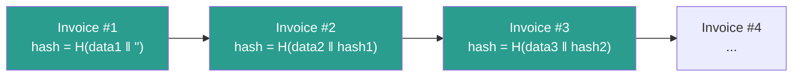
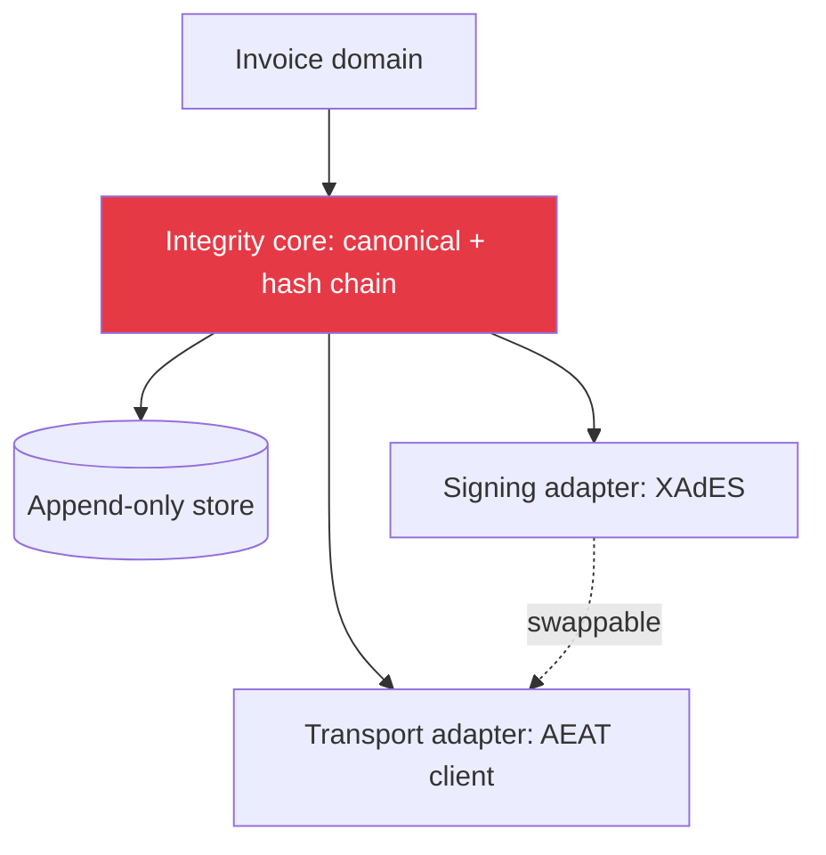

# Building Tamper-Evident Invoicing for Spain's VeriFactu (RD 1007/2023)

> A practical engineering write-up on hash-chained invoices, fail-closed compliance, and why the database — not the app — should own the integrity invariant.

---

## Context: what RD 1007/2023 actually demands

Spain's anti-fraud regulation (Royal Decree 1007/2023, the "VeriFactu" regime) targets a specific fraud: software that lets a business **silently delete or alter sales** after the fact ("double-use" cash registers).

The legal requirements that translate into engineering constraints:

1. **Inalterability** — once issued, an invoice cannot be modified without detection.
2. **Traceability** — invoices form an ordered chain; each links to the previous.
3. **Integrity** — a cryptographic fingerprint per record.
4. **Conservation** — records are retained and exportable in a defined format.
5. **Reporting** — in `VERI*FACTU` mode, records are transmitted to the AEAT (tax authority).

Note what is *not* strictly required: the regulation mandates a **hash chain** and integrity, while the qualified electronic signature (XAdES) path is one of two modalities. Knowing which guarantee is legal vs. which is an implementation choice is half the battle.

---

## The core data structure: a hash chain

Every invoice record carries the hash of the previous record. Conceptually:

```
record_n.hash = H( canonical(record_n_fields) || record_{n-1}.hash )
```



Tamper with invoice #2 and its hash changes; invoice #3's stored `prev_hash` no longer matches; the break is **localizable and provable**. That is the entire point — you do not prevent a malicious DB write, you make it *undeniable*.

### Canonicalization is where bugs hide

The hash is only meaningful if the input is canonical. Two systems must derive **byte-identical** input from the same logical invoice. Pitfalls I hit:

- Floating-point amounts → use fixed-point/decimal strings (`"12.40"`, never `12.4`).
- Field ordering → fix an explicit ordered list, never `dict` iteration order.
- Encoding → UTF-8, normalized, no locale-dependent number formatting.
- Dates → a single ISO-8601 form, one timezone.

A canonicalization function with a frozen, versioned spec — and golden-vector tests — is non-negotiable.

---

## Design principle 1: the integrity invariant belongs in the database

The naive design enforces chaining in application code: read last hash, compute, insert. Under concurrency this races — two requests read the same `prev_hash` and fork the chain.

Better: make the database the source of truth.

- A monotonic per-issuer sequence, allocated transactionally.
- The chain link computed inside the same transaction that inserts the row.
- A `UNIQUE` constraint on `(issuer_id, sequence)` so a fork *cannot* be committed.
- The previous-hash read uses row locking so concurrent issuers serialize on the tail.

The application can be buggy; the chain still cannot fork, because the invariant is a constraint, not a code path.

---

## Design principle 2: compliance fails closed

A reporting subsystem that talks to a government API has many failure modes: cert expired, endpoint down, schema rejected. The dangerous anti-pattern is **failing open** — issuing the invoice anyway and "retrying later" silently.

Rules I enforced:

- `compliant` (production AEAT) mode is a single, guarded switch. It refuses to enable without a real certificate and the required compliance flags present at boot — not at first request.
- If AEAT submission fails, the invoice does not silently "succeed". It enters an explicit `pending_submission` state, surfaced and alerted, never swallowed.
- Sandbox vs. production is isolated behind one interface so test code paths can never accidentally hit production.

> A compliance module that fails silently is worse than no module — it gives false legal confidence.

---

## Design principle 3: separate the integrity core from the transport

XAdES signing and AEAT SOAP/REST transport are *replaceable*. The hash chain is *forever*. I kept them in separate layers:



The integrity core has zero knowledge of HTTP, certificates or AEAT XSDs. It is pure, deterministic, and exhaustively unit-tested with golden vectors. Everything network-facing is an adapter behind an interface — and therefore mockable in CI.

---

## Testing strategy

| Test type | What it proves |
|-----------|----------------|
| Golden-vector unit tests | Canonicalization + hash are stable across refactors |
| Chain-tamper tests | Mutating any record is detected at verification |
| Concurrency tests | Parallel issuance never forks the chain |
| Fail-closed tests | AEAT failure → `pending`, never silent success |
| Contract tests (sandbox) | Our payload matches the AEAT schema |

The chain-tamper test is the one that matters most: it asserts the *security property the law cares about*, not just "the code runs".

---

## Takeaways for engineers

1. **Read the regulation, separate legal-must from implementation-choice.** Hash chain = mandatory integrity primitive; signature modality is a design decision.
2. **Push invariants into the database.** Forking a hash chain should be impossible by constraint, not by careful code.
3. **Compliance fails closed.** Silent retry is a legal liability.
4. **Isolate the deterministic core** from certificates and network so it stays testable.
5. **Test the property, not the path.** "Tampering is detected" is the spec.

---

*Written by Francisco Amaro — Backend Engineer & SOC L1 Analyst. I build secure, fiscal-compliant SaaS in Spain. [GitHub](https://github.com/franamaro-dev) · [LinkedIn](https://linkedin.com/in/franamaro)*

*Companion code concepts: [VeriFactu-SOC-Demo](https://github.com/franamaro-dev/VeriFactu-SOC-Demo) · [VeriStack](https://github.com/franamaro-dev/VeriStack)*
